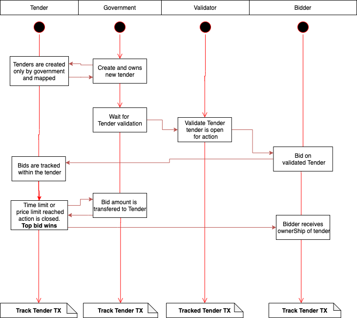
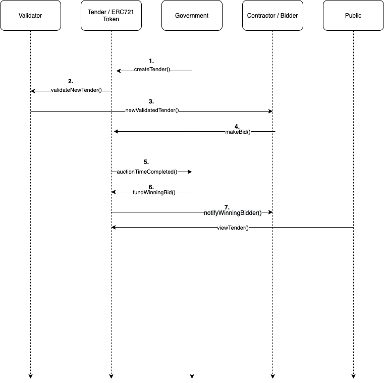

# ProcurementSmartContract

## Quick Start

### Pre-requisites

NodeJs v14.16.1 with npm

Truffle v5.3.3

Ganache

### Install Node libarays 

Open a terminal and cd into the ProcurementSmartContract directory. Install librarys with the following command.

    npm install 
    
### Compiling contracts 

Within the same terminal run.

    truffle compile
    
### Migrating contracts to ganache

    truffle migrate -development

## Diagrams

Created with [Draw.io](https://www.diagrams.net/). To make changes to the diagrams. Download the [.drawio files](./assets/diagrams) and open existing diagram within draw.io

### ProcurementActivityDiagram

### Sequence Diagram

